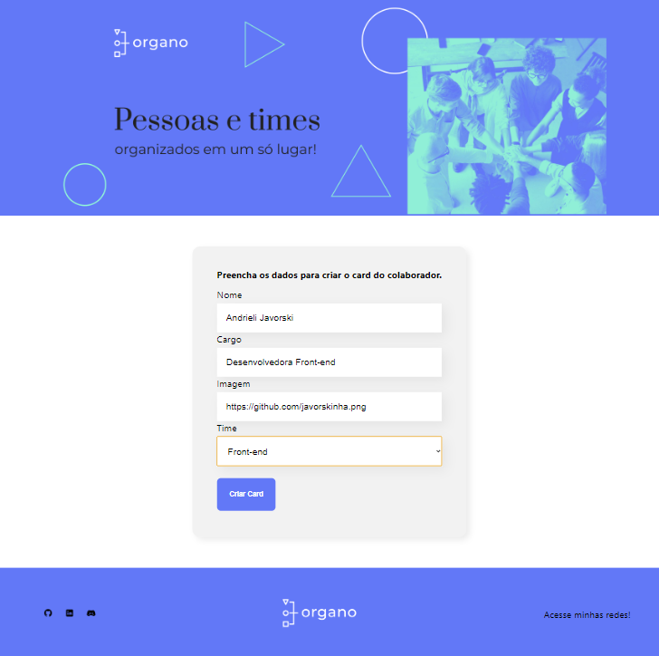
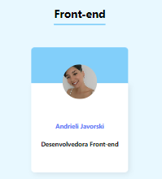

# ORGANO

<h3>Organo é um projeto React que desenvolvi no curso 'REACT: DESENVOLVENDO COM JAVASCRIPT' na Alura</h3>

Nesse projeto tive meu primeiro contato com react, ele foi criado a partir do 'create react app' utilizando node.js, e desenvolvido componente por componente, cada um com index.js e uma follha de estilos css.

Realizei o importe dos componentes, e a conexão entre eles, conhecendo dezenas das possibilidades que o react trás para a criação de aplicações dinâmicas.

<h2>TESTE A APLICAÇÃO!</h2>

O ORGANO é um site onde é possivel realizar o cadastro de desenvolvedores, que serão subdivididos em times. De acordo com os dados fornecidos no formulário, a plicação irá destinar cada colaborador cadastrado ao seu respectivo time, organizando assim uma lista de colaboradores, em uma lista de times. Cada cadastro irá gerar um Card do colaborador

Cada time é caracterizado por 2 cores e terá uma sessão individual, somente os times que possuem colaboradores cadastrados vão estar visíveis ao scrolar a página. Para testar as funcionalidades da aplicação, basta realizar os cadastros que desejar preenchendo o formulário!
